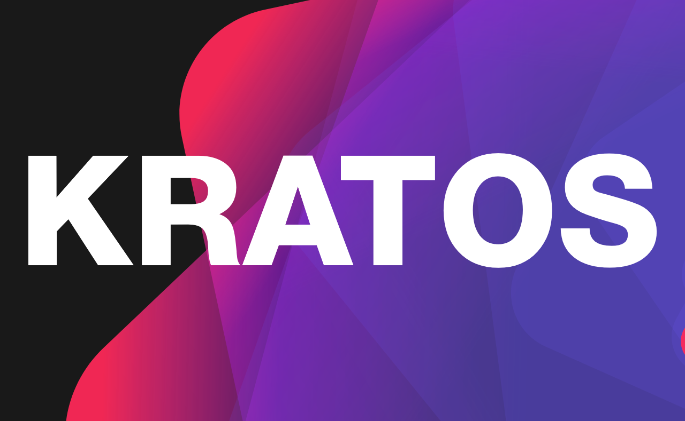

<div align="center">
    
    <br>
    <a href="https://github.com/SchizoidDevelopment/kratos">
        
    </a>
    <a href="https://central.sonatype.com/artifact/dev.lyzev.api/kratos">
        
    </a>
    <a href="https://lyzev.dev/discord">
        
    </a>
    <a href="https://schizoiddevelopment.github.io/kratos/">
        
    </a>
    <a href="https://github.com/SchizoidDevelopment/kratos/pulls">
        
    </a>
    <a href="https://github.com/SchizoidDevelopment/kratos/issues">
        
    </a>
</div>


# Kratos: Setting Management for Kotlin

A flexible Kotlin library for seamless management and tracking of customizable application settings. Simplify the process of integrating user-configurable options into your projects.

> [!TIP] 
> Kratos is specifically designed for Kotlin and works best when used with Kotlin’s coding style. It’s strongly recommended to use it exclusively with Kotlin.

## Usage

[](https://central.sonatype.com/artifact/dev.lyzev.api/kratos)

### Import

Replace `${version}` with the latest version of Kratos!

<details>
    <summary>Gradle (KTS)</summary>

```kt
repositories {
    mavenCentral()
}

dependencies {
    implementation("dev.lyzev.api", "kratos", "${version}")
}
```

</details>

<details>
    <summary>Gradle (Groovy)</summary>

```groovy
repositories {
    mavenCentral()
}

dependencies {
    implementation 'dev.lyzev.api:kratos:${version}'
}
```

</details>

<details>
    <summary>Maven</summary>

```xml
<dependencies>
    <dependency>
        <groupId>dev.lyzev.api</groupId>
        <artifactId>kratos</artifactId>
        <version>${version}</version>
    </dependency>
</dependencies>
```

</details>

<details>
    <summary>Raw Jar</summary>

1. Visit the [Maven Central Repository](https://search.maven.org/artifact/dev.lyzev.api/kratos) and download the JAR file for the version you need.
2. Add the downloaded JAR to your project.
3. You're all set!

</details>

### Example Usage

```kt
import dev.lyzev.api.setting.Setting
import kotlin.reflect.KClass

/**
 * A specific implementation of the [Setting] class for boolean settings.
 *
 * @param container The class of the settings container where this setting belongs.
 * @param name The name of the setting.
 * @param value The initial value of the boolean setting.
 * @param hide A lambda function that determines whether this setting is hidden or not.
 * @param change A lambda function that will be called when the value of the setting changes.
 */
class BooleanSetting(
    container: KClass<*>, name: String, value: Boolean, hide: () -> Boolean = { false }, change: (Boolean) -> Unit = {}
) : Setting<Boolean>(container, name, null, value, hide, change)

object Test { 
    var setting by BooleanSetting(BooleanSetting::class, "Test", true) { println("Setting changed to $it") }
}

fun main() {
    // Print the initial value of the setting.
    println(Test.setting)

    // Change the value of the setting to 'false'.
    Test.setting = false

    // Print the updated value of the setting.
    println(Test.setting)
}
```

## Documentation

For detailed documentation, check out the full [Kratos Documentation](https://schizoiddevelopment.github.io/kratos/).

## Bugs and Suggestions

### Discord Community

Need help with minor concerns or have questions? Join our supportive community on the [Discord server](https://lyzev.dev/discord). Our friendly members and staff are here to assist you!

[](https://lyzev.dev/discord)

### GitHub Issues

For bugs or suggestions, please submit them via the [GitHub Issue Tracker](https://github.com/SchizoidDevelopment/kratos/issues). Kindly use the provided templates and include all relevant details to ensure we can resolve your issue quickly. Your cooperation is greatly appreciated!

---
*Kratos is developed and maintained by Schizoid Development. Thank you for using Kratos!*
